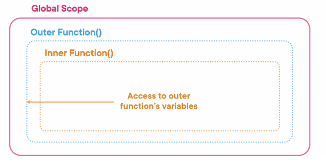
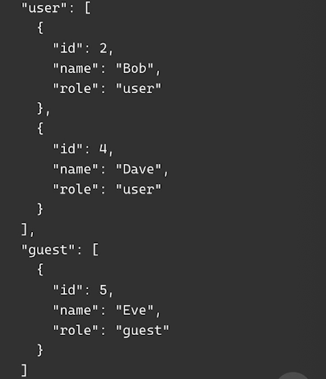
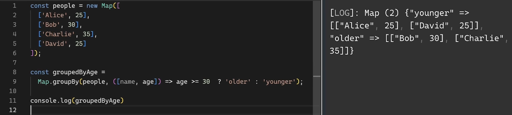
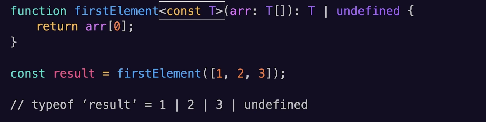

# TypeScript Deep Dive Lesson 1

## What’s New in Typescript

### Decorators
```typescript
// Decorator Example
// - Takes in 1 or more functions
function logDecorator(fn) {
	return function(a,b) { 
		console.log(`Entering function with arguments: ${a} ${b}`);
		const result = fn(a, b);
		console.log(`Exiting function with result: ${result}`);
		return result
	}
}
```
- Closures: Are created when a function is created w/in another function
	- 
- tsconfig: "experimentalDecorators": true

### Implicit Returns
- tsconfig: "noImplicitReturns" = true
```typescript
// Function Lacking Return Statement
function checkNumber(num: number): string {
	if (num > 0) {
		return 'positive';
	} else if (num < 0) {
		return 'negative';
	}
}
// Typescript error: Function lacks ending return statement and return types does not include 'undefined'
```

### Importing Attributes
```typescript
// Importing Files Before Typescript 5
import data from `./data.json`;

// Importing Files in Typescript 5
import data from `./data.json` with { type: 'json' };

// Importing a CommonJS module
const fs = require('fs');

// Importing a JSON file
const data = require('./data.json';)

// Import Assertions
import data from './data.json' assert { type: 'json' };
```
- Import assertions require the --experimental-json modules in older version

### Object.groupBy
- Groups objects by a certain key
- Object.groupBy(object, callback)
	- Object (or iterable): the source of the object or iterable whose properties need to be grouped
	- Callback: A function that determines which group each element should belong to
- tsconfig: "target" = ‘esnet’
- Example: 
```typescript
const users = {
	{id: 1, name: 'Bob', role: 'admin'},
	{id: 2, name: 'Alice', role: 'user'},
	{id: 3, name: 'Charlie', role: 'admin'},
	{id: 4, name: 'Dave', role: 'user'},
	{id: 5, name: 'Eve', role: 'guest'},	
}

const groupByRole = Object.groupBy(users, user => user.role);
```
- console.log output:
	

### Map.groupBy
- Map.groupBy (map, callBackfn)
	- Map: The map object you want to group
	- callbackFn: The function tha determines how the grouping should be done
- Overall working with key-value pairs and categorize by
- Example:
	

### Const Type Parameters
- Uses ofConst Type Parameters: passing data structures, working with configuration objects, preserving literal types with generics
- Example 1:
	
- Example 2: 
	

### Using Declarations
- ‘Using’ Declarations: automatic cleanup afterwards
- using resource = expression;

### Multiple Configurations Files in 'extends'
- Multiple Config Files
- Example: “extends”: [./tsconfig.base.json, ./tsconfig.project.json] 
- But be careful about overriding and be sure to separate configurations
- Usage: Separate configruations, reusable configurations, and overriding settings