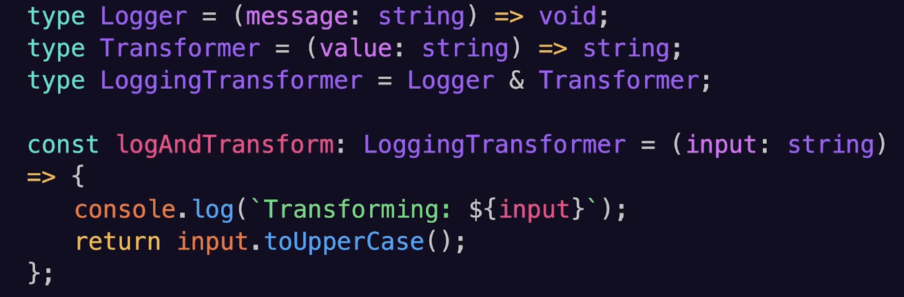

# TypeScript Deep Dive Lesson 2

## Advanced Types and Type Inference

### Literal Types
- Types that represent specific, exact values, rather than a range of values, allowing for more precise type checking and constraints
```typescript
// Literal Types
const greeting: "Hello" = "Hello"

const luckyNumber: 7 = 7

const isTrue: true = true

type DiceRoll = 1 | 2 | 3 | 4 | 5 | 6
const roll: DiveRoll = 4
const invalidRoll: DiceRoll = 9 // Try to add another type and it results to an error

type Direction = "North" | "South" | "East" | "West"

function move(direction: Direction) {
	console.log(`Moving ${direction}`)
}

move("North");
move("Up"); // invalid, which will cause an error
```

### Union type example: 
- Union types in Typescript enable a variable, parameer, or return  value to aaccept multiple specified types
- Example: variable: number | string

### Discriminated Unions
- Discrimintaed unions in Typescript are a pattern where a type can be one of several variants, each identified by a unique "discriminant" property, enabling type-safe operations based on that identifier
- "This OR That"
- Example:
	
- Used to explicitly show a type may not be present
- Example
	```typescript
	type User = {
		name: string;
		email: string | undefined;
	};
	const user: User = {name: "Alice"}
	```

### Intersections 
- "This AND That"
```typescript
type Wizard = {
	castSpell: () => void
}

type Warrior = {
	swingSword: () => void
}

type Battlemage = Wizard & Warrior

const gandalf: Battlemage = {
	castSpell() => console.log("You shall not pass!"),
	swingSword() => console.log("For Frodo!"),
}
```
- Intersecting types with properties with the same name
	```typescript
	type A = { x: number }
	type B = { x: string }

	type AB = A & B
	
	// AB is equivalent to {x : never }
	```

- Function Intersections Example
	
- Intersections with Generics Example
	

### Type Inferences
- Typescript's ability to automatically deduce the type of a variable based on its value or how it's used

### Type Assertions
- Type assertions don't change the actual type of the value at runtime - they're purely a compile time construct

### Type Guards
- Custom Type Guards are a powerful feature in TypeScript that allows us to perform precise runtime checks and inform the TypeScript compiler about the specific type of a value
- Example:
	```typescript
	function isString(value: unknown) value is string { // If True, then value is string
		return typeof value === 'string';
	}
	```
- Example:
	


