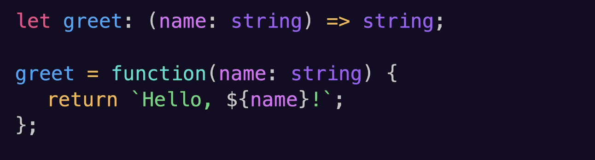
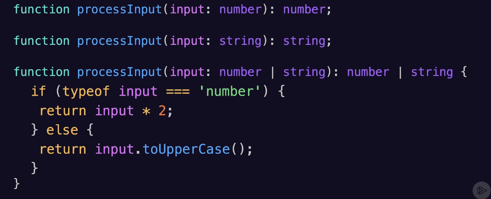
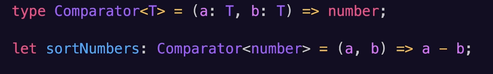
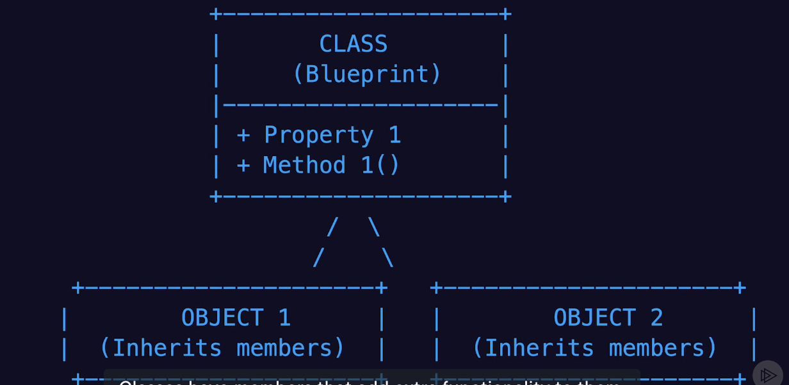
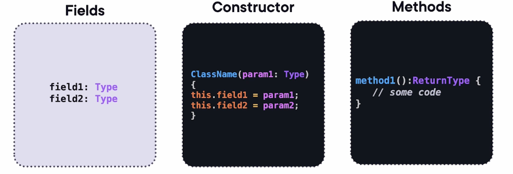
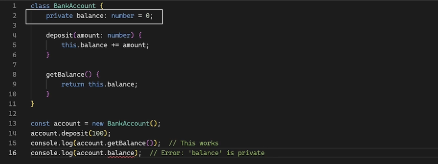

# TypeScript Deep Dive Lesson 3

## Function, Classes and Interfaces

### Function Types
- Example:
	
- Arrow Function Example:
	- let double = (x: number): number => x * 2
- Arrow Functions - Rest Parameters Example:
	- let sum: (...numbers: number[]) => number;
	- arbitrary number of arguments
- Functions Overloads
	
- Generic Function Types Example:
	- let identity: <T>(arg: T) => T;
- Type Alises
	- 

### Classes
- A class is a blueprint for creating objects that encapsulate data and behavior
	- 
- 
	- Fields: Class-level writable variables
		- Can have modifiers sucha as "readonly", which make them immutable after they are initiailized
	- Constructor: Special methods that are called when creating an instance of a class. 
		- Example: class Person { constructor (public name: string, public age: number) {} } 
			- Creates public fields and initialize them with values passed through it
	- Methods: Functions that belong to the class
- Class Modifiers: How a class is modified/accessed (private/public)
- Inheritance: Creating new classes based on existing ones

### Access Modifiers
- Public: It's open to every part of the program
- Private: Only the specific class/object that owns it can use it. It's hidden from the rest of the program
- Protected: The class owns it and any class that inherit from it can use what's protected
- 

### Interfaces for Complex Structures
- Complex Structure: An object that might have nested properties, optional fields, function signatures, and other interfaces

