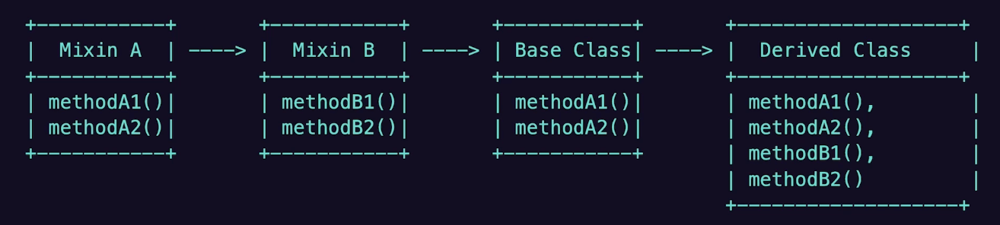

# TypeScript Deep Dive Lesson 4

## Generics and Advanced Features

### Generics
- Generics enable the creation of components that can operate with a variety of data types instead of a singular type
	- Prevents code duplication
	- Promotes abstract and reusable code, while ensuring type safety
```typescript
function genericBox<T>(item: T): T {
	return item;
}
```

### Metadata and Annotations
- Metadata and annotations allow to write declarative code 
- Metadata: data that provides information about other data
- Decorators: Angular, Nest JS, Type ORM
	- tsconfig configurations
		- "experimentalDecorators": true
		- "emitDecoratorMetadata": true

### Mixins
- Define a set of features or behaviors that can be "mixed in" to different classes
- 
- Mixins vs. Interfaces
	- Mixins provide the implementation of the class
	- Interfaces define a contract that a class must adhere to
- Benefits of Mixins
	- Encourages code reusability
	- Provides architectural flexibility
	- Complex problems are made simpler
	- Can add new functionality to existing code

