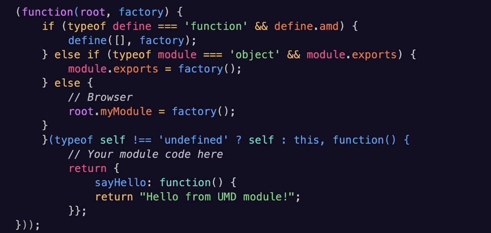

# TypeScript Deep Dive Lesson 5

## Modules, Namespaces, and Dependency Management

### Imports and Experts
- IIFE
	```typescript
	(function() {
		// Some code here
	})();
	```
- CommonJs
	```typescript
	const path = require('path')
	module.exports = {}
	```
- Asynchronous Module Definition (AMD)
	- define(['module1', 'module2'], function () {});
- Universal Module Definition (CommonJS & AMD)
	
- ES6 Imports and Exports
	```typescript
	import {someFunction} from "a-library";
	export default someFunction {}
	```
- Module Resolution Flow
	- Import and Export Validation
	- Additional Syntax (imports type to specifically import a specific type)
	- Flexible output
- Hosts in module Systems: for Module Loading, File Path resolution, Caching Modules
- Hosts in module Systems: Browser, NodeJS, 
- Declaration Files (d.ts)
	- 
	- Used to understand the types used in a library
- Library type Resolution Strat
	- @types
	- .d.ts
- Module Resolution Process
	


### Organizing Code with Modules
- Modules are clear boundaries in your application and manage dependencies
- Each module should have a single responsibility; Each module should have one and only one reason to change.
	- Focus on a single feature/concept
	
- Barrel Files: Instead of multiple export statements from the same file, condense it into one export statement
- Organize by feature
- Make modules for shared types
- Avoid circular dependencies

### Namespaces (Internal Modules)
- Provide a way to group related code (like functions, classes, interfaces, etc.) under a single name to avoid global namespace pollution and to structure your code more logically


