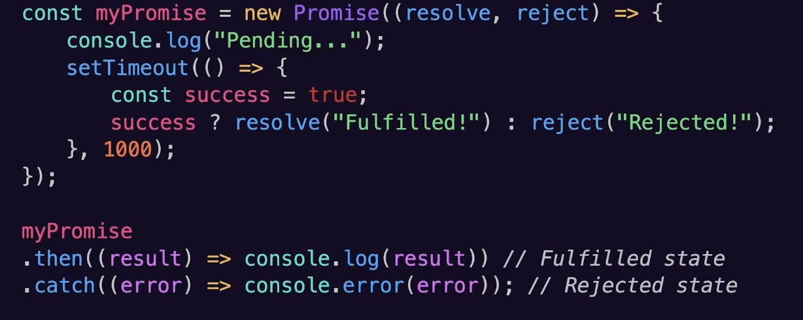
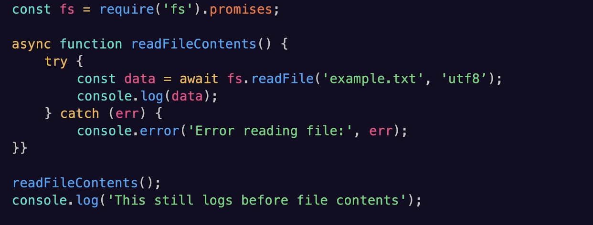

# TypeScript Deep Dive Lesson 6

## Debugging and Refactoring TS Applications

- Callback function: Passes as an argument to another function and is executed after some operation has been completed
- Promises: Provide a more structured way to handle asynchronous operations
	- 
	- Has three states: Pending, Fulfilled, or Rejected
- Async Await
	- 
- Error Handling
- Promises
